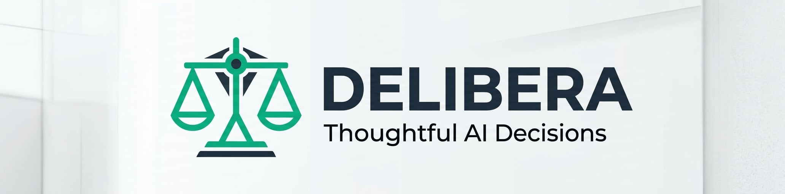

<div align="center">



# Delibera — Быстрый старт

### ⚖️ Продуманные решения с помощью ИИ

🇬🇧 [English version (QuickStart.md)](QuickStart.md)

</div>

Это руководство за несколько минут проведёт вас через ваше первое обсуждение с помощью ИИ в
**Delibera**. По его завершении у вас будут запущенные локально многомодельные дебаты и
Markdown-стенограмма на диске.

---

## 1. Требования

- [.NET 10 SDK](https://dotnet.microsoft.com/download/dotnet/10.0) (≥ 10.0.301) — проект нацелен на
  `net10.0` и собирается с `LangVersion=preview` для включения возможностей **C# 15**. См.
  [NET10-Upgrade-RU.md](NET10-Upgrade-RU.md) для полных заметок о миграции.
- Запущенный экземпляр [Ollama](https://ollama.com) — либо:
  - **Локально:** [установите Ollama](https://ollama.com/download) и запустите `ollama serve`, либо
  - **Cloud:** зарегистрируйтесь в [Ollama Cloud](https://ollama.com/cloud) и получите API-ключ
    (без установки, без GPU).
- **Опционально — для роли Operator:** [Node.js + npx](https://nodejs.org) для запуска MCP-серверов
  (например, `@playwright/mcp`, `@marp-team/marp-cli`). См. [раздел 7](#7-использование-operator-mcp-инструменты).

### Модели для установки

Выберите **один** из наборов моделей ниже в зависимости от вашего железа. Набор 🟡 «Стандартный»
рекомендуется для большинства случаев.

#### 🟢 Минимальный — слабое железо / smoke-тесты (≈ 2 ГБ всего)

```bash
ollama pull llama3.2:1b
ollama pull qwen2.5:1.5b
ollama pull nomic-embed-text
```

#### 🟡 Стандартный — рекомендуется (≈ 7 ГБ всего)

```bash
ollama pull llama3.2:3b
ollama pull qwen2.5:7b
ollama pull nomic-embed-text
```

#### 🔴 Высокопроизводительный — GPU с ≥ 24 ГБ VRAM или Ollama Cloud (≈ 30+ ГБ)

```bash
ollama pull llama3.1:8b
ollama pull qwen2.5:14b
ollama pull mistral:7b
ollama pull nomic-embed-text
```

> ℹ️ Ollama Cloud использует те же имена моделей — локальная загрузка не нужна, только API-ключ.

---

## 2. Установка пакета

```bash
dotnet add package Delibera.Core
```

Или клонируйте репозиторий и сошлитесь на `Delibera.Core` напрямую:

```bash
git clone https://github.com/delibera/Delibera.git
cd Delibera
```

---

## 3. Ваше первое обсуждение

Создайте консольный проект и вставьте следующее:

```csharp
// Program.cs
using Delibera.Core.Council;
using Delibera.Core.Providers;

using var factory = new ProviderFactory();
var ollama = factory.CreateOllama("http://localhost:11434");

var result = await new CouncilBuilder()
    .AddMember("llama3.2:3b", ollama, "Analyst")
    .AddMember("qwen2.5:7b", ollama, "Strategist")
    .SetChairman(Chairman.CreateStandard("qwen2.5:7b", ollama))
    .WithStandardDebate()
    .WithSystemPrompt("You are a software architecture expert.")
    .WithUserPrompt("Microservices vs Monolith for a 5-person startup?")
    .WithMaxRounds(4)
    .SaveResultTo("./deliberation.md")
    .Build()
    .ExecuteAsync();

Console.WriteLine(result.FinalVerdict);
```

Запустите:

```bash
dotnet run
```

Delibera проведёт структурированные многораундовые дебаты и запишет полную стенограмму и вердикт
председателя в файл `deliberation.md`.

> ☁️ **Используете Ollama Cloud?** Замените endpoint на `https://api.ollama.com` и передайте API-ключ:
> `factory.CreateOllama("https://api.ollama.com", "YOUR_API_KEY")`.

---

## 4. Использование Dependency Injection

```csharp
using Delibera.Core.DependencyInjection;
using Microsoft.Extensions.DependencyInjection;

var services = new ServiceCollection();

// Привязывает секцию "Delibera" из appsettings.json
services.AddDelibera(configuration, "Delibera");

var provider = services.BuildServiceProvider();
var builder = provider.GetRequiredService<ICouncilBuilder>();
```

`appsettings.json`:

```json
{
  "Delibera": {
    "Strategy": "Standard",
    "MaxRounds": 4,
    "Temperature": 0.7,
    "SystemPrompt": "You are a knowledgeable AI expert participating in a council debate.",
    "Providers": {
      "DefaultType": "Ollama",
      "DefaultEndpoint": "http://localhost:11434",
      "ApiKey": "",
      "EmbeddingModel": "nomic-embed-text"
    },
    "Compression": {
      "Enabled": true,
      "Strategy": "Hybrid",
      "TargetRatio": 0.5,
      "EnableCache": true,
      "MaxCacheEntries": 256
    },
    "Rag": {
      "Enabled": false,
      "ProviderType": "Qdrant",
      "Host": "localhost",
      "Port": 6334,
      "CollectionName": "council_knowledge",
      "ConnectionString": null
    },
    "Output": {
      "Directory": "./debate_results",
      "SeparateFiles": true,
      "FilePrefix": null
    }
  }
}
```

> Для **Ollama Cloud** задайте `Providers:DefaultEndpoint` равным `https://api.ollama.com` и
> `Providers:ApiKey` равным вашему ключу.

---

## 5. Добавление сжатия контекста

```csharp
using Delibera.Core.Compression;
using Delibera.Core.Providers.LLM;

var ollama = new OllamaProvider("http://localhost:11434");
var embeddings = new OllamaEmbeddingProvider(ollama, "nomic-embed-text");

var result = await new CouncilBuilder()
    .AddMember("llama3.2:3b", ollama, "Analyst")
    .AddMember("qwen2.5:7b", ollama, "Strategist")
    .SetChairman(Chairman.CreateStandard("qwen2.5:7b", ollama))
    .WithCompression(CompressionStrategy.Hybrid,
        llmProvider: ollama,
        modelName: "llama3.2:3b",
        embeddingProvider: embeddings)
    .WithCompressionCache()
    .WithUserPrompt("Analyze our architecture options...")
    .WithMaxRounds(4)
    .Build()
    .ExecuteAsync();

Console.WriteLine(result.TokenStats?.ToSummary());
```

Сжатие экономит примерно **30–70% токенов** без потери смысла контекста дебатов.

---

## 6. Добавление RAG с Qdrant

```bash
docker run -d -p 6333:6333 -p 6334:6334 qdrant/qdrant
```

```csharp
using Delibera.Core.Council;
using Delibera.Core.Models;
using Delibera.Core.Providers.LLM;
using Delibera.Core.Providers.RAG;

var ollama = new OllamaProvider("http://localhost:11434");
var embeddings = new OllamaEmbeddingProvider(ollama, "nomic-embed-text");

var ragFactory = new RagProviderFactory();
var rag = ragFactory.CreateQdrant(embeddings, "localhost", 6334);

var kkMember = new CouncilMember("llama3.2:3b", ollama, "Knowledge Keeper");
var keeper = new KnowledgeKeeper(rag, kkMember, "architecture_kb");
await keeper.IndexFileAsync("./docs/architecture.md");

var result = await new CouncilBuilder()
    .AddMember("llama3.2:3b", ollama, "Backend Expert")
    .AddMember("qwen2.5:7b", ollama, "DevOps Expert")
    .SetChairman(Chairman.CreateStandard("qwen2.5:7b", ollama))
    .WithKnowledgeKeeper(keeper)
    .WithStandardDebate()
    .WithUserPrompt("Our startup has 4 developers. Microservices or monolith?")
    .WithMaxRounds(4)
    .Build()
    .ExecuteAsync();
```

> 💡 Замените `CreateQdrant(...)` на `CreatePgVector(embeddings, connectionString)`, чтобы
> использовать PostgreSQL/pgvector.

---

## 7. Использование Operator (MCP-инструменты)

**Operator** — это микроагент, который соединяет совет с внешними инструментами через серверы
[**MCP (Model Context Protocol)**](https://modelcontextprotocol.io) — веб-навигация, доступ к
файловой системе, генерация Marp-презентаций и многое другое. Участники делегируют задачу в любой
момент, написав маркер `[[OPERATOR: ...]]`, и Operator запускает нужные инструменты и возвращает
результат в следующий раунд.

### 7.1. Установка требований

Серверы из примеров ниже запускаются через `npx`, поэтому вам нужны **Node.js + npx**:

```bash
# Проверьте, что Node.js / npx доступны
node --version
npx --version

# Для сервера браузера один раз установите движки Playwright:
npx playwright install
```

Также нужна запущенная **Ollama** с дешёвой моделью для Operator (например, `llama3.2`) — Operator
использует свою собственную модель, отдельную от участников совета.

### 7.2. Настройка MCP-серверов

Каждый MCP-сервер описывается через `McpServerConfig`. Используйте `Stdio(...)` для локальных
процессов или `Http(...)` для удалённых серверов:

```csharp
using Delibera.Core.Models;

var servers = new[]
{
    // 🌐 Браузер — навигация, чтение страниц, клики, скриншоты
    McpServerConfig.Stdio(
        name: "browser",
        command: "npx",
        arguments: new[] { "-y", "@playwright/mcp@latest", "--headless" }),

    // 🎯 Marp — генерация презентаций HTML/PDF/PPTX из Markdown
    McpServerConfig.Stdio(
        name: "marp",
        command: "npx",
        arguments: new[] { "-y", "@marp-team/marp-cli", "--server", "./out" }),

    // …или удалённый HTTP/SSE MCP-сервер с заголовками авторизации:
    // McpServerConfig.Http(
    //     name: "remote",
    //     endpoint: "https://my-mcp-host.example.com/mcp",
    //     additionalHeaders: new Dictionary<string, string> { ["Authorization"] = "Bearer <token>" }),
};
```

| Сервер       | Транспорт | Команда запуска                                 | Что даёт                                             |
| ------------ | --------- | ----------------------------------------------- | ---------------------------------------------------- |
| 🌐 `browser` | stdio     | `npx -y @playwright/mcp@latest --headless`      | Навигация по сайтам, чтение страниц, клики, скриншоты |
| 🎯 `marp`    | stdio     | `npx -y @marp-team/marp-cli --server <dir>`     | Генерация презентаций (HTML/PDF/PPTX) из Markdown     |

### 7.3. Прямое использование (без совета)

```csharp
using Delibera.Core.Council;
using Delibera.Core.Interfaces;
using Delibera.Core.Models;
using Delibera.Core.Providers.LLM;
using Delibera.Core.Providers.Mcp;

var ollama = new OllamaProvider("http://localhost:11434");

await using var @operator = new Operator(
    new CouncilMember("llama3.2", ollama, "Operator"),
    new IMcpClient[] { new McpClientAdapter(servers[0]), new McpClientAdapter(servers[1]) });

await @operator.InitializeAsync();   // подключается к серверам и обнаруживает инструменты

// 1) Открыть сайт и пересказать его
var browse = await @operator.ExecuteTaskAsync(
    "Open https://modelcontextprotocol.io and briefly summarize what MCP is.");
Console.WriteLine(browse.FinalAnswer);

// 2) Сгенерировать презентацию из 3 слайдов и сохранить как deck.html
var deck = await @operator.ExecuteTaskAsync(
    "Generate a 3-slide Marp presentation about .NET 10 and save it as deck.html.");
Console.WriteLine(deck.FinalAnswer);
```

> `await using` освобождает MCP-клиентов через `ValueTask DisposeAsync` у Operator.

### 7.4. Operator внутри дебатов

Добавьте Operator в совет с помощью удобной перегрузки `WithOperator(...)`. Участники затем
делегируют работу через маркер `[[OPERATOR: ...]]`, и их результаты внедряются в последующие раунды:

```csharp
var result = await new CouncilBuilder()
    .AddMember("llama3.2:3b", ollama, "Researcher")
    .AddMember("qwen2.5:7b",  ollama, "Reviewer")
    .SetChairman(Chairman.CreateStandard("qwen2.5:7b", ollama))
    // Operator использует свою более дешёвую модель; reuseCompression разделяет компрессор совета
    .WithOperator("llama3.2", ollama, servers, reuseCompression: true)
    .WithStandardDebate()
    .WithSystemPrompt(
        "You may delegate research or presentation tasks to the Operator by writing " +
        "[[OPERATOR: <task>]] in your message.")
    .WithUserPrompt("Research the latest .NET 10 features and prepare a short summary deck.")
    .WithMaxRounds(4)
    .SaveResultTo("./deliberation.md")
    .Build()
    .ExecuteAsync();

Console.WriteLine(result.FinalVerdict);
```

Сообщение участника может выглядеть так:

```
I think we should highlight the runtime improvements.
[[OPERATOR: open https://learn.microsoft.com/dotnet/core/whats-new/dotnet-10 and list the top 5 features]]
```

Все взаимодействия с Operator записываются по раундам и отображаются в финальном Markdown-отчёте в
блоке **🛠️ Operator Interactions**.

### 7.5. Настройка через `appsettings.json`

```json
{
  "Delibera": {
    "Operator": {
      "Enabled": true,
      "ModelName": "llama3.2",
      "ReuseCompression": true,
      "McpServers": [
        {
          "Name": "browser",
          "Transport": "Stdio",
          "Command": "npx",
          "Arguments": [ "-y", "@playwright/mcp@latest", "--headless" ]
        },
        {
          "Name": "marp",
          "Transport": "Stdio",
          "Command": "npx",
          "Arguments": [ "-y", "@marp-team/marp-cli", "--server", "./out" ]
        }
      ]
    }
  }
}
```

> ▶️ Запустите полное демо: `dotnet run --project src/Delibera.ConsoleApp -- --operator-mcp`.
> См. [`OperatorMcpToolsExample.cs`](../src/Delibera.ConsoleApp/Examples/OperatorMcpToolsExample.cs)
> и [NET10-Upgrade-RU.md](NET10-Upgrade-RU.md) для деталей.

---

## 8. Сохранение раздельных выходных файлов

```csharp
var (resultPath, statsPath, logsPath) = await result.SaveAllAsync("./output");
// → debate_<timestamp>_result.md
// → debate_<timestamp>_statistics.md
// → debate_<timestamp>_logs.md
```

Каждый файл — это обычный Markdown, идеальный для коммита в git, публикации в чат-инструменты или
передачи обратно в другую LLM.

---

## 9. Изучите ConsoleApp

В репозитории есть запускаемое демо в
[`src/Delibera.ConsoleApp/`](../src/Delibera.ConsoleApp/), которое задействует каждую возможность:

| Пример               | Команда                          | Что демонстрирует                              |
| -------------------- | -------------------------------- | ---------------------------------------------- |
| Быстрый старт        | `dotnet run`                     | Дебаты по умолчанию из `appsettings.json`      |
| Dependency injection | `dotnet run -- --di`             | `AddDelibera()` + резолвинг `ICouncilBuilder`  |
| Раздельный вывод     | `dotnet run -- --separate-files` | `SaveAllAsync()` — три Markdown-файла          |
| Сжатие контекста     | `dotnet run -- --compression`    | Все 4 стратегии + кэш + статистика токенов     |
| Несколько провайдеров| `dotnet run -- --multiprovider`  | Cloud + локальные модели в одном совете        |
| RAG (Qdrant)         | `dotnet run -- --rag`            | Индексирование документов + Knowledge Keeper   |
| RAG (pgvector)       | `dotnet run -- --pgvector`       | Векторный поиск на базе PostgreSQL             |
| Operator (основы)    | `dotnet run -- --operator`       | Роль Operator с MCP-инструментами              |
| Operator + MCP       | `dotnet run -- --operator-mcp`   | 🆕 MCP-серверы browser + Marp в совете         |
| Microsoft.Extensions.AI | `dotnet run -- --msai`        | 🆕 `IChatClient`/`IEmbeddingGenerator` + middleware |

---

## Дальнейшие шаги

- Прочитайте [README](../README-RU.md) для полного обзора возможностей, архитектуры и паттернов проектирования.
- См. [CONTRIBUTING.md](../CONTRIBUTING.md), если хотите внести вклад.

---

<div align="center">

**⚖️ Delibera — Продуманные решения с помощью ИИ**

</div>
